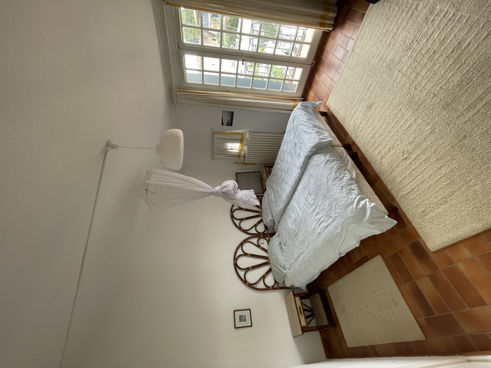

**Chambre parentale avec balcon privé**  

La chambre parentale est un véritable havre de paix, pensé pour offrir confort et sérénité :  
- **Lit double** : Un lit spacieux et confortable, idéal pour des nuits réparatrices.  
- **Balcon privé** : Cette chambre s’ouvre sur un balcon offrant une vue agréable, parfait pour profiter de la brise méditerranéenne ou savourer un moment de calme.  
- **Rangements** : Dotée de nombreux rangements, cette pièce permet de garder un espace ordonné et fonctionnel, avec des armoires intégrées ou des placards spacieux.  
- **Ambiance élégante** : La décoration soignée et les matériaux de qualité confèrent une atmosphère apaisante, idéale pour des séjours agréables.  

Ces deux chambres distinctes permettent de répondre aux besoins de toute la famille, dans un cadre fonctionnel et agréable.

**La vue du balcon de la chambre des parents**

**Chambre d’enfants pratique et fonctionnelle**  

La chambre pour enfants est conçue pour être à la fois pratique et adaptée aux besoins des plus jeunes :  
- **Lit superposé et lit simple** : Trois couchages au total, parfaits pour accueillir plusieurs enfants ou des invités.  
- **Rangements généreux** : De nombreux placards, tiroirs et armoires permettent de ranger vêtements, jouets et affaires personnelles en toute simplicité.  
- **Espace optimisé** : L’aménagement maximise l’espace, laissant suffisamment de place pour jouer ou se détendre.  
- **Style accueillant** : Avec une décoration ludique ou épurée, cette chambre offre un cadre chaleureux et confortable pour les enfants.  

