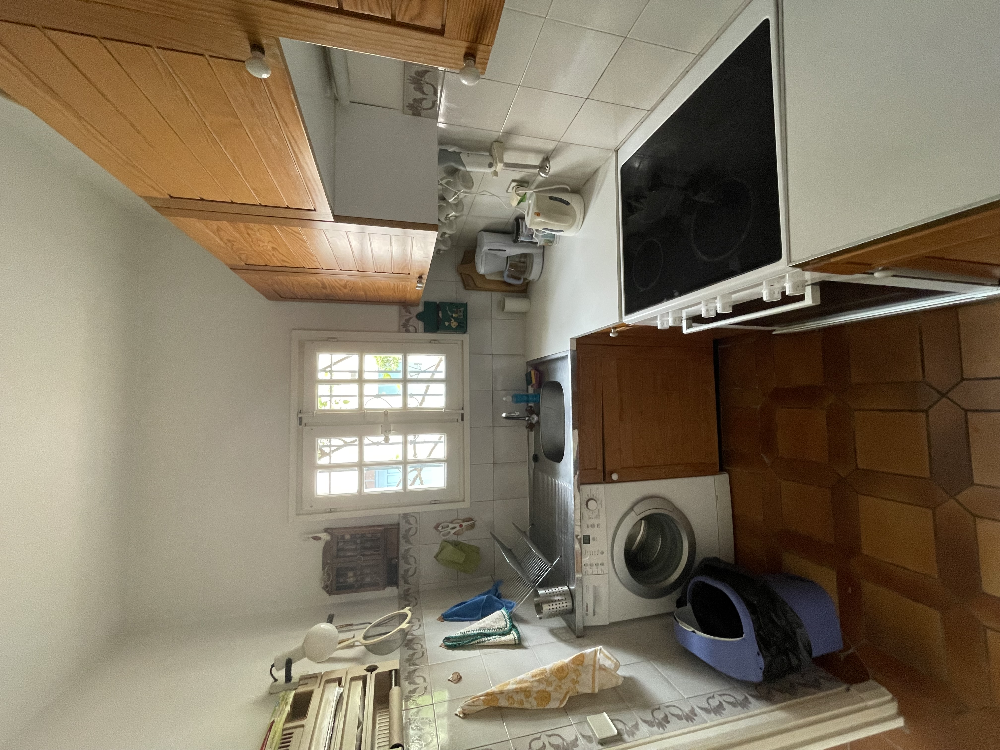
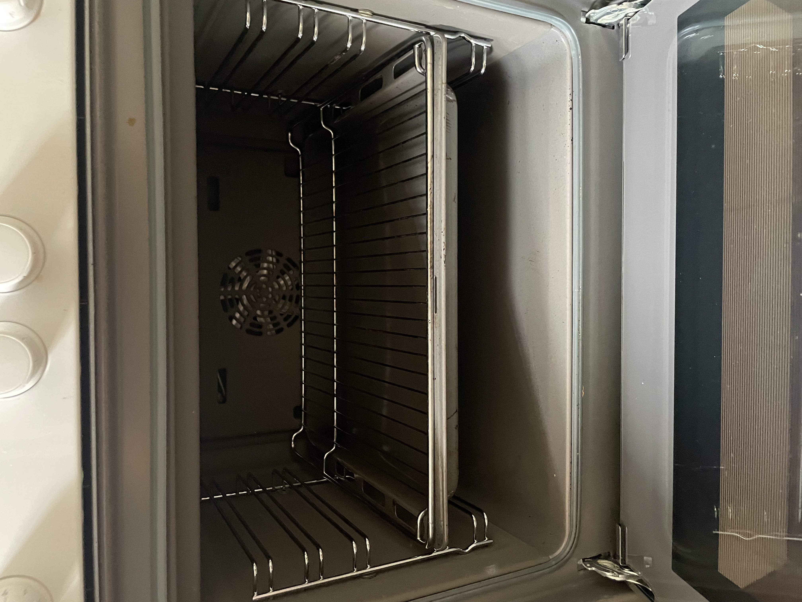
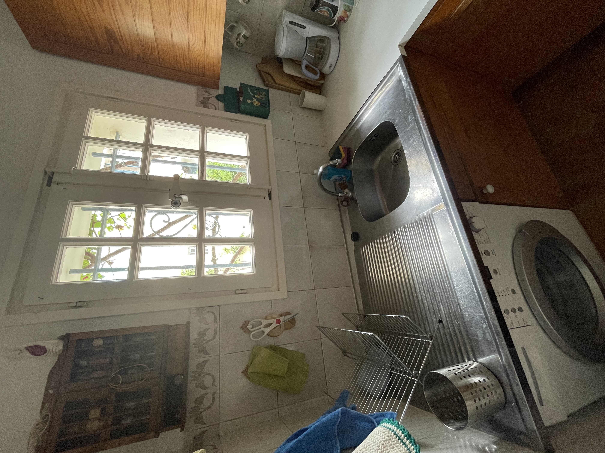

**Cuisine fonctionnelle et conviviale**  

La cuisine de ce logement à Port Grimaud est à la fois élégante et pratique, pensée pour répondre à tous vos besoins culinaires.  

- **Équipements modernes** : Elle est entièrement équipée avec des appareils de qualité, notamment un réfrigérateur, un four, une plaque de cuisson, un lave-vaisselle et un micro-ondes, parfaits pour préparer vos repas en toute simplicité.  
- **Rangements optimisés** : De nombreux placards et tiroirs offrent un espace de rangement généreux pour vos ustensiles, vaisselle et provisions.  
- **Espace ouvert** : La disposition ouverte ou semi-ouverte permet de cuisiner tout en restant connecté avec vos invités dans la pièce à vivre ou sur la terrasse.  
- **Style accueillant** : Le design allie charme méditerranéen et modernité, avec des finitions soignées qui s’intègrent harmonieusement à l’ambiance chaleureuse du logement.  

Que vous souhaitiez préparer un simple petit-déjeuner ou un dîner gourmet, cette cuisine saura vous séduire par son confort et son praticité.

