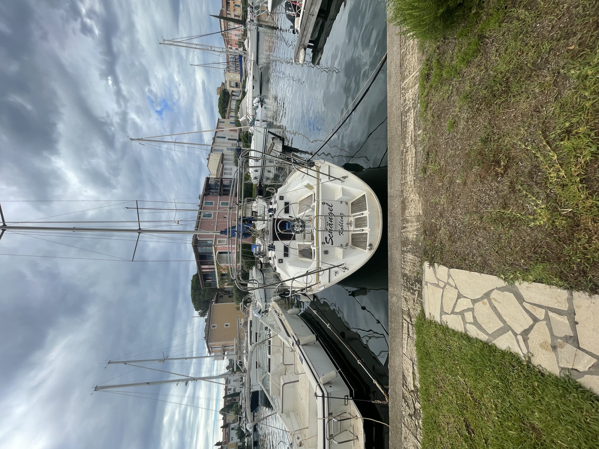

**Jardin avec amarre et vue imprenable sur les canaux**  

Le jardin de ce logement à Port Grimaud est un véritable écrin de sérénité, offrant un espace extérieur parfaitement aménagé pour profiter pleinement du cadre unique de la cité lacustre.  

- **Espace détente** : Des transats confortables vous invitent à vous prélasser sous le soleil méditerranéen ou à lire un livre en toute tranquillité.  
- **Coin repas en plein air** : Une table à manger élégante, accompagnée d’un parasol dépliable, est idéale pour savourer vos repas en extérieur, à l’ombre et avec une vue exceptionnelle.  
- **Amarre privée** : Directement accessible depuis le jardin, l’amarre peut accueillir un bateau de plus de 10 mètres, offrant une opportunité rare pour les amateurs de navigation.  
- **Vue pittoresque** : Le jardin s’ouvre sur les canaux de Port Grimaud, offrant un spectacle magnifique des bateaux qui passent et de l’atmosphère paisible de la lagune.  

Ce jardin est un véritable atout, mêlant convivialité, détente, et fonctionnalité, pour profiter pleinement du charme de Port Grimaud.

