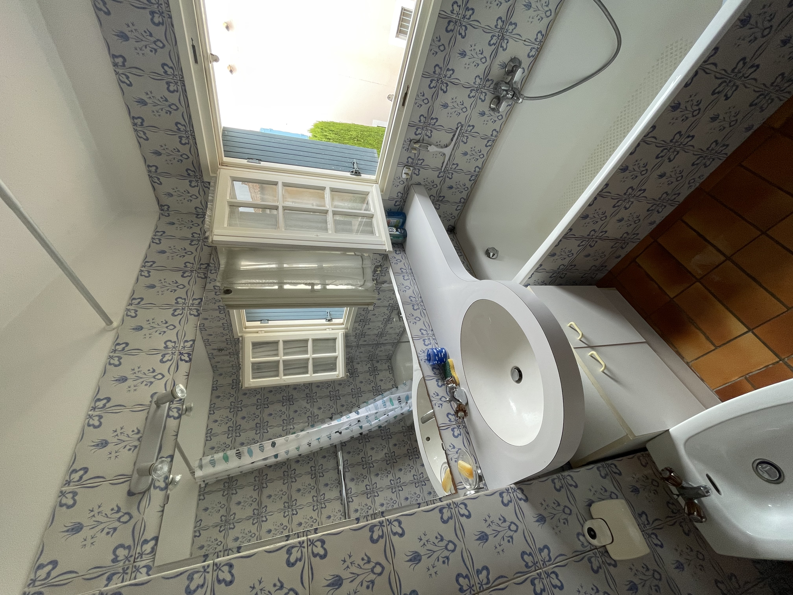
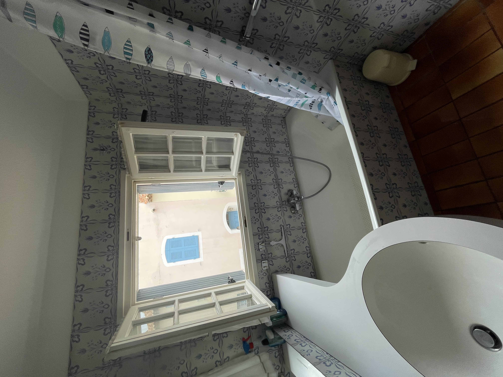

**Salle de bain du rez-de-chaussée**  

Fonctionnelle et moderne, cette salle de bain est idéale pour un usage quotidien :  
- **Douche spacieuse** : Une cabine de douche pratique et bien conçue, parfaite pour un usage rapide et efficace.  
- **Toilettes** : Un WC intégré pour plus de commodité.  
- **Lavabo** : Un lavabo avec meuble de rangement, offrant un espace pratique pour vos produits de toilette.  
- **Ambiance moderne** : Une décoration épurée avec des matériaux de qualité, pour un espace agréable et facile à entretenir.  

**Salle de bain à l’étage**  

Pensée pour le confort, la salle de bain à l’étage offre plus d’espace et des équipements variés :  
- **Baignoire** : Une baignoire idéale pour des moments de détente après une journée bien remplie.  
- **Douche intégrée** : Une douche pratique en complément de la baignoire, parfaite pour s’adapter aux besoins de chacun.  
- **Lavabo avec rangements** : Un lavabo élégant avec un meuble intégré, permettant de garder vos affaires bien organisées.  
- **Toilettes** : Un WC intégré pour un espace tout-en-un.  
- **Style raffiné** : Une atmosphère chaleureuse et lumineuse, grâce à des finitions soignées et des tons apaisants.  

Ces deux salles de bain distinctes offrent praticité et confort pour toute la famille, répondant aux besoins du quotidien comme aux envies de détente.

