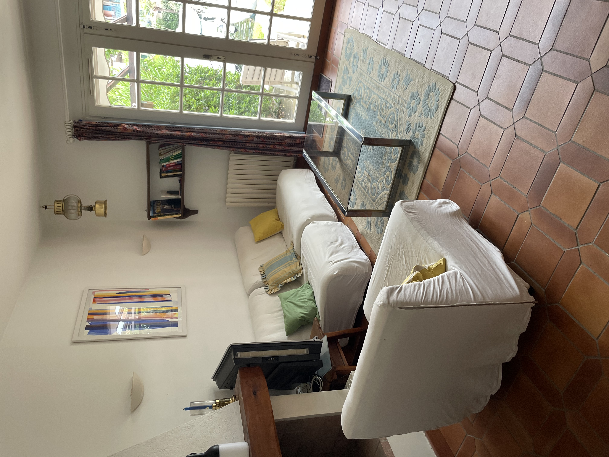
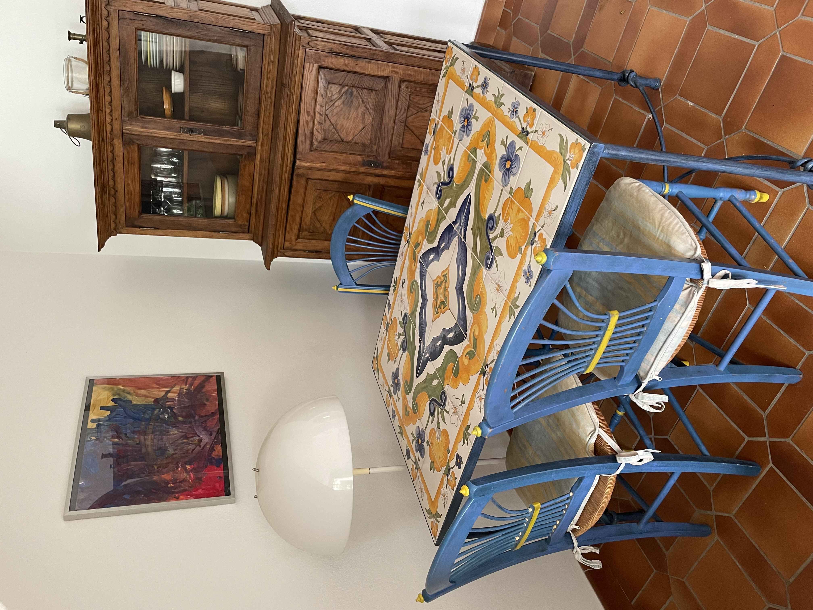

**Salon chaleureux et convivial**  

Le salon de ce logement à Port Grimaud est un espace lumineux et accueillant, conçu pour vous offrir confort et moments de partage.  

- **Espace détente** : Un canapé confortable est disposé face à une télévision moderne, idéal pour se relaxer après une journée passée à explorer la région ou à naviguer sur les canaux.  
- **Coin repas** : Une table à manger élégante et fonctionnelle vous permet de profiter de repas conviviaux en famille ou entre amis, dans une ambiance chaleureuse.  
- **Escalier vers l’étage** : Un escalier mène à l’étage, ajoutant une touche de charme à l’ensemble tout en délimitant harmonieusement les espaces.  
- **Décoration soignée** : Le salon est aménagé avec goût, dans un style méditerranéen ou moderne, pour refléter l’ambiance unique de Port Grimaud.  

Cet espace central est le cœur du logement, parfait pour se détendre, se retrouver et profiter pleinement de votre séjour.

**Des photos de la table à manger**

**Une photo de l'escalier qui monte à l'étage**

